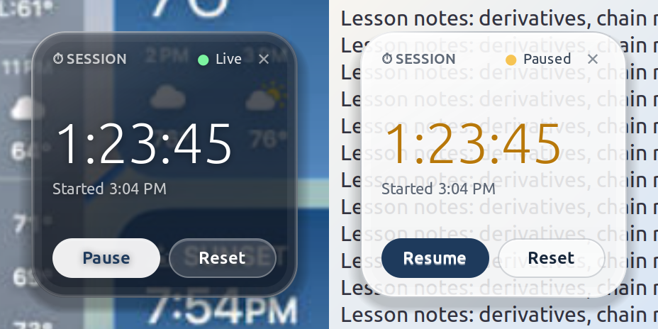

# Session Timer

A small frameless glass timer that floats above every window on your Ubuntu desktop. Made for online tutors who charge by the hour: the elapsed time stays visible to you and — on a screen share — to your student.

<p align="center"></p>

*Design reference: the macOS / iOS Weather widgets and iOS 26's liquid glass — translucent, rounded, a bright rim, one big light-weight number.*

## What it does

- **Floats above everything**, on every workspace. No title bar, no frame — just the widget.
- **Light and dark glass**, following your system's appearance setting (or pick one by right-clicking).
- **Start / Pause / Resume / Reset**, by button or keyboard.
- Shows **when the session started**, so both sides can check the start time.
- **Accurate:** elapsed time is derived from the clock, not from counting ticks.
- **Survives a restart:** the current session is saved, so closing and reopening the app doesn't lose the time.
- **Zero dependencies** beyond what Ubuntu ships (Python 3 + GTK 3). One file.

## Install

**Ubuntu / Debian — download the package** from the [latest release](https://github.com/Zee5han/session-timer/releases/latest), then:

```bash
sudo apt install ./session-timer_1.2.0_all.deb
```

It appears in your app grid as **Session Timer**. Remove it with `sudo apt remove session-timer`.

**From source, no sudo:**

```bash
git clone https://github.com/Zee5han/session-timer.git
cd session-timer
./install.sh
```

That puts the app in your app grid and on your PATH as `session-timer`, all under `~/.local`. Run `./uninstall.sh` to remove it.

> Pick one method. A `~/.local` install shadows the `.deb`'s launcher, so if you switch from `./install.sh` to the package, run `./uninstall.sh` first.

Or skip installing and just run it:

```bash
/usr/bin/python3 session_timer.py
```

If GTK's Python bindings are missing (they're preinstalled on Ubuntu Desktop): `sudo apt install python3-gi gir1.2-gtk-3.0`.

## Use

| Action | Mouse | Keyboard |
| --- | --- | --- |
| Start / pause / resume | **Start** / **Pause** / **Resume** button | `Space` |
| Reset | **Reset** button | `R` |
| Move | Drag anywhere on the glass | |
| Keep on top, light/dark, Quit | Right-click | `Ctrl+Q` (quit), or the ✕ |

> **Screen sharing:** students see the timer when you share your **entire screen**. If you share a single window, it won't be included.

## About the glass effect

The widget draws its own glass — translucent tint, refracted inner edge, specular highlight, soft shadow. What it can't do by itself is blur what's *behind* it: on Linux only the compositor can do that.

- **KDE Plasma:** the app asks KWin for blur-behind automatically. Turn on *System Settings → Desktop Effects → Blur* if it isn't already.
- **GNOME (Ubuntu default):** GNOME has no blur-behind for apps. If you want it, install the [Blur my Shell](https://extensions.gnome.org/extension/3193/blur-my-shell/) extension, open its settings → *Applications*, enable blur and add `session-timer` to the whitelist.
- Anything else: you get the translucent glass without background blur, which still reads fine over most desktops.

## How always-on-top works

Wayland doesn't let regular apps pin themselves above other windows, so the app runs through XWayland (`GDK_BACKEND=x11`), where GNOME and KDE honour the *keep above* hint. That's automatic; you don't need to do anything.

## Files

```
session_timer.py       the whole app
session-timer.desktop  app-grid launcher
session-timer.svg      icon
install.sh             per-user install (~/.local)
uninstall.sh
packaging/build-deb.sh builds the .deb attached to releases
web/                   earlier browser version (Chrome picture-in-picture), kept for non-Linux users
```

## License

MIT — see [LICENSE](LICENSE).
